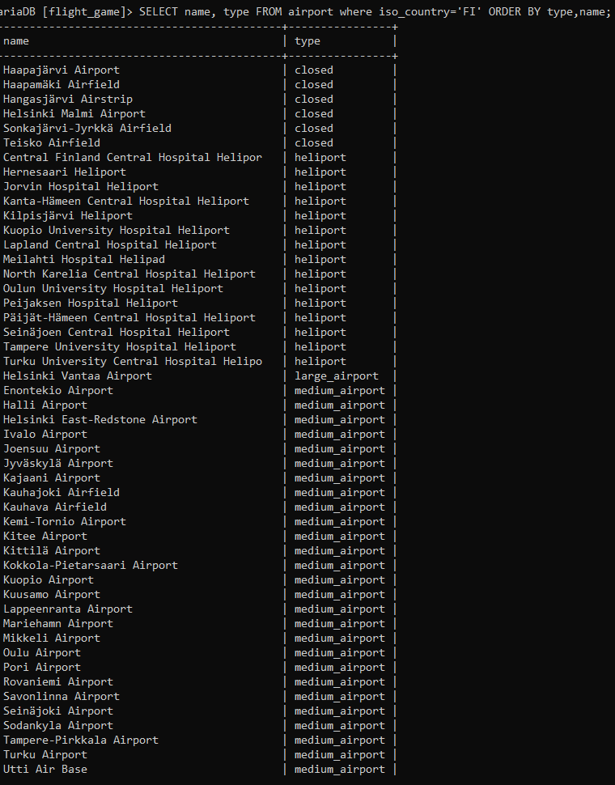
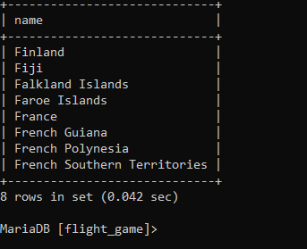
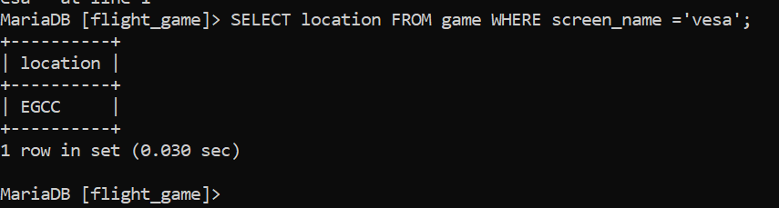

### Tehtävä 1
SELECT * from goal;

### Tehtävä 2
SELECT name from airport where iso_country='FI' ORDER BY name;

### Tehtävä 3
SELECT name, type from airport where iso_country='FI'

### Tehtävä 4
SELECT name, type FROM airport where iso_country='FI' ORDER BY type,name

### Tehtävä 5
SELECT name from country WHERE name LIKE 'F%';

### Tehtävä 6
SELECT name from country where name LIKE '%F%';

### TEHTÄVÄ 7
CELECT location FROM game WHERE screen_name='vesa';

